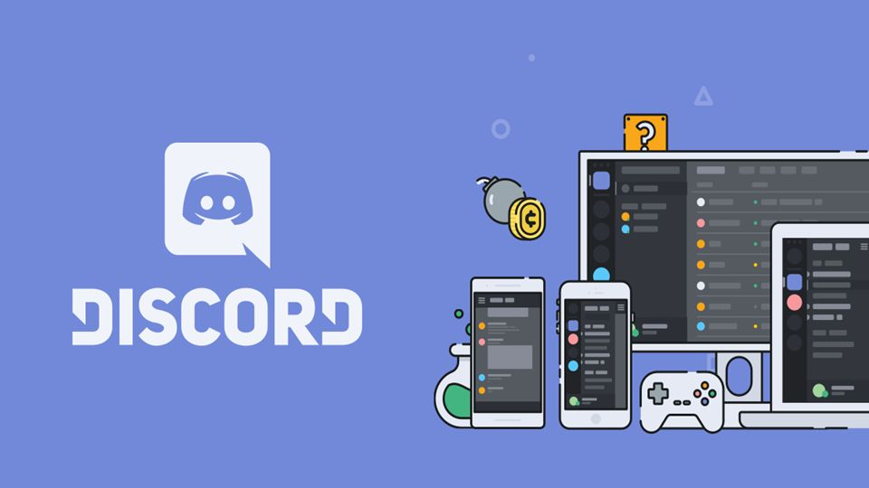
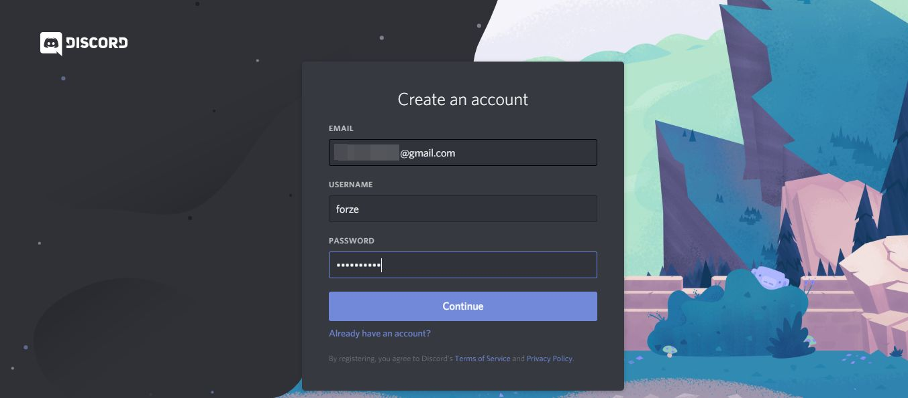
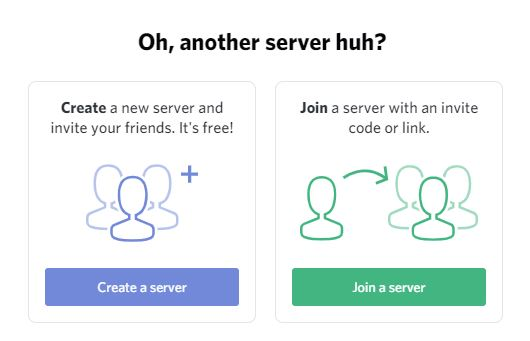
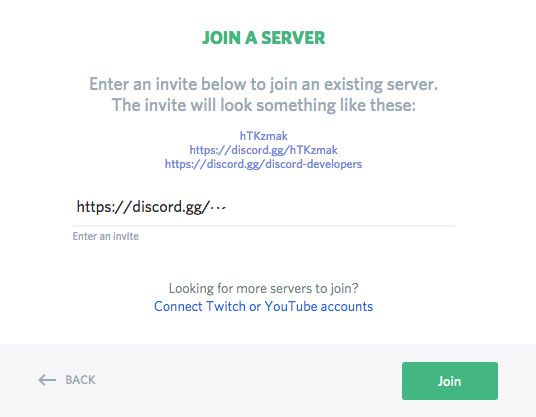
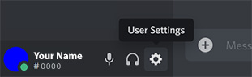
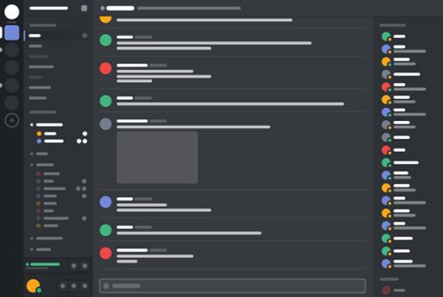

Αν είστε φίλοι του παιδικού βιβλίου, είτε επαγγελματίες με ενδιαφέρον για την προσβασιμότητα των βιβλίων και την διαπολιτισμικότητα, η online κοινότητά μας είναι μόνο η αρχή. Απέναντι στις προκλήσεις των καιρών και για τις αξίες που μας αντιπροσωπεύουν, αυτός ο ψηφιακός χώρος έρχεται για να διευκολύνει για την αντάμωση, την συζήτηση και την συνδημιουργία.

Στις επόμενες παραγράφους έχουμε συγκεντρώσει κάποιες σύντομες οδηγίες πλοήγησης — έχοντας υπόψη πως για τους νέους όλα είναι εύκολα. 😹

<iframe src="https://discord.com/widget?id=795645642349346816&theme=dark" width="100%" height="500" allowtransparency="true" frameborder="0" sandbox="allow-popups allow-popups-to-escape-sandbox allow-same-origin allow-scripts"></iframe>

<a href="https://discord.gg/ZGEmvZv88f">Συνδεθείτε στην κοινότητά μας</a>

## Τί είναι το Discord;

Το Discord είναι μια πλατφόρμα για ζωντανές παράλληλες συζήτησεις με κείμενο και φωνή. Για τους νεώτερους δεν χρειάζεται συστάσεις, αλλά για τους παλαιότερους, θυμίζει κάτι μεταξύ IRC και forum. Αναπτύχθηκε αρχικά για να εξυπηρετήσει κοινότητες με ενδιαφέρον στα ψηφιακά παιχνίδια, και πλέον εξαιτίας της ευχρηστίας του χρησιμοποιείται από βιβλιοθήκες, δημιουργικές ομάδες και κοινότητες εθελοντών.

To Discord έχει μια αυξημένη πολυπλοκότητα απέναντι σε τρόπους δικτύωσης που ίσως είναι πιο οικείοι όπως π.χ. τα Facebook Groups ή εφαρμογές chat όπως τα Viber, WhatsApp κ.α., που όμως δεν επιτρέπουν έλεγχο από πολλούς διαχειριστές. Ταυτόχρονα παραμένει πιο προσβάσιμο από ένα τυπικό forum επειδή διαθέτει mobile εφαρμογές για όλες τις πλατφόρμες.

Επιτρέπει παράλληλες δημόσιες συζητήσεις δομημένες ανά θεματική, κλειστές συζητήσεις με ομάδες εργασίες και voice chat σε μικρές ή μεγαλύτερες ομάδες. Οι συζητήσεις διατηρούν ιστορικό που είναι ορατό και μέλη που εγγράφηκαν αργότερα.

Επίσης επιτρέπει λεπτομερή ρύθμιση των ειδοποιήσεων (notifications), ώστε να ειδοποιούμαστε μόνο για εκείνα που μας ενδιαφέρουν ή απεθύνονται σε εμάς, ανάμεσα σε μεγάλες συζητήσεις.

Τα μέλη μπορούν να συνδέονται χωρίς τον αριθμό του τηλεφώνου τους, χωρίς σύνδεση με προσωπικό προφίλ —ακόμα και με ψευδώνυμο αν το επιθυμούν.

## Δημιουργία λογαριασμού

Τα βήματα που ακολουθούν αφορούν την δημιουργία λογαριασμού και σύνδεση μέσω υπολογιστή, αλλά υπάρχουν διαθέσιμες εφαρμογές για όλες τις πλατφόρμες (Windows, Mac OS, Linux, Android, iOS).

- Πλοηγούμαστε στη διεύθυνση https://discord.com/register για να δημιουργήσουμε ένα λογαριασμό χρήστη.
- Συμπληρώνουμε το email μας, δημιουργούμε ένα κωδικό και επιλέγουμε το επιθυμητό username που θα είναι ορατό στους υπολοίπους. Το username δεν είναι απαραίτητο να είναι το πραγματικό μας όνομα. Το email μας δεν είναι ορατό σε άλλους χρήστες.
- Κάνουμε κλικ στο “Continue” για να επιβεβαιώσουμε.
- Έπειτα επιβεβαιώνουμε την ηλεκτρονική μας διεύθυνση κάνοντας κλικ στον υπερσύνδεσμο “Verify Email” που θα λάβουμε στο email μας από το Discord.
- Μόλις ολοκληρώσουμε τα προηγούμενα, μπορούμε να εγκαταστήσουμε την εφαρμογή του Discord στην συσκευή μας ή να συνδεθούμε μέσα από τον περιηγητή μας (Firefox, Chrome κ.ο.κ.) στη σελίδα www.discord.com.

Αν διαθέτετε ήδη λογαριασμό στο Discord, μπορείτε να συνδεθείτε με τον ίδιο, επιλέγοντας να διατηρήσετε το ίδιο όνομα ή να αλλάξετε το όνομα που θα εμφανίζεται στον server της Ανοικτής Παιδικής Βιβλιοθήκης.

## Σύνδεση σε ένα Discord server

Κατά την ορoλογία του Discord, ένας server αντιστοιχεί σε μια κοινότητα και όλα τα δωμάτια (chatrooms) όπου μπορούν να γίνονται οι συζητήσεις.

Ο πιο εύκολος τρόπος να συνδεθούμε σε ένα server είναι να ακολουθήσετε μια πρόσκληση. Η πρόσκληση για την κοινότητα της Ανοικτής Παιδικής Βιβλιοθήκης βρίσκεται στον ακόλουθο σύνδεσμο:  
👉 https://discord.gg/ZGEmvZv88f

- Συνδεόμαστε στη σελίδα www.discord.com με τον λογαριασμό μας, και κάνουμε κλικ στο εικονίδιο ( + ) στην αριστερή κάθετη μπάρα.
- Έπειτα κάνουμε κλικ στο κουμπί “Join a server” στο παράθυρο που εμφανίζεται.
- Στο επόμενο παράθυρο, κάνουμε επικόλληση τον προηγούμενο σύνδεσμο (URL) της πρόκλησης.
- Κάνουμε κλικ στο “Join” και πλέον έχουμε συνδεθεί στην κοινότητα της Ανοικτής Παιδικής Βιβλιοθήκης.

## Εξατομίκευση του προφίλ μας

Μπορούμε να αλλάξουμε το πως εμφανίζεται το όνομα και το avatar μας όταν συζητάμε στο chat. Κάνουμε κλικ στο γρανάζι κάτω αριστερά δίπλα στο username μας.

Στην επόμενη οθόνη, πατώντας στο “Edit” ή μπορούμε να αλλάξουμε το avatar (εικονίδιο προφίλ) και το username (όνομα χρήστη) μας.

Σημαντικές είναι επίσης οι ρυθμίσεις για τις ειδοποιήσεις (notifications). Σε αντίθεση με ένα messenger app (Viber, Whatsapp κ.ο.κ.) δεν θεωρούμε πως ο,τι γράφουμε πρέπει να εμφανίζεται άμεσα στους υπολοίπους. Όπως σε ένα «παραδοσιακό» φόρουμ, το πόσο συχνά συνδέεται κανείς και επιλέγει να συμμετέχει στις συζητήσεις είναι κατόπιν επιλογής.

Κάποια μηνύματα με χαρακτήρα επείγουσας ενημέρωσης προν την κοινότητα, ενδέχεται να προκαλέσουν κάποιο notification εκτός και αν έχουμε διαφορετικές προσωπικές ρυθμίσεις.

## Περιβάλλον διεπαφής

Το περιβάλλον του Discord έχει την ακόλουθη δομή:

1. Η πρώτη στήλη από αριστερά, επιτρέπει την μετακίνηση μεταξύ server, την προσθήκη νέων κ.ο.κ..
2. Η δεύτερη στήλη από αριστερά εμφανίζει τα κανάλια κειμένου (chat) και φωνής (voice) και τις κατηγορίες που ανήκουν. Ανάλογα με την ιδιότητά μας (π.χ. Μέλη της Ανοικτής Παιδικής Βιβλιοθήκης) να έχουμε πρόσβαση σε κανάλια που δεν εμφανίζονται δημόσια. Τα κανάλια κειμένου είναι διαφορετικά από τα κανάλια φωνής. Όταν συμμετέχουμε σε κανάλι κειμένου δεν λειτουργεί το μικρόφωνό μας.  
Στο κάτω μέρος της δεύτερης στήλης, εμφανίζεται το username και οι επιλογές για τις ρυθμίσεις μας, και αν το μικρόφωνό μας είναι ενεργοποιημένο ή όχι.
3. Η τρίτη και μεγαλύτερη στήλη εμφανίζει τις συζητήσεις στο κανάλι που έχουμε επιλέξει. Το όνομα του καναλιού είναι ορατό πάνω-πάνω, και τα μυνήματα εμφανίζονται σε χρονολογική σειρά.
4. Στην τέταρτη στήλη εμφανίζονται τα μέλη της κοινότητας που είναι συνδεδεμένα εκείνη τη στιγμή, και όσα μέλη είναι offline.

Η μπάρα για τα μηνύματά μας είναι στο κάτω μέρος της τρίτης στήλης:

- Μπορούμε να γράψουμε κείμενο (μέχρι 2000 χαρακτήρες ανά μήνυμα), μαζί με emoji, εικόνες και υπερσυνδέσμους. Κάποια κανάλια ενδέχεται να μην επιτρέπουν ανέβασμα εικόνων.
- Μπορούμε να απευθύνουμε ένα μήνυμα προς κάποιο άλλο μέλος δημόσια, γράφοντας το username τους μετά τον χαρακτήρα @ αντίστοιχα με το “mention” σε κάποια μέσα κοινωνικής δικτύωσης.
- Με τα αντίστοιχα εικονίδια του μικροφώνου και του ακουστικού στη δεύτερη στήλη, ορίζουμε τις ρυθμίσεις μας όταν συμμετέχουμε σε κάποιο voice chat.

## Βασικοί κανόνες

Δεν υπάρχει λόγος για αυστηρούς κανόνες συμπεριφοράς, αρκεί να συμπεριφερόμαστε με σεβασμό και ευγένεια προς τους άλλους. Οι διαχειριστές της κοινότητας διατηρούν το δικαίωμα να αποκλείσουν όποιο λογαριασμό χρήστη ή σχόλιο οποιαδήποτε στιγμή και για όποιο λόγο κρίνουν πως αντιτίθεται με τους κανόνες του διαλόγου ή τις αρχές του σωματείου.

Κάποιες συμπεριφορές δεν θα γίνονται ανεκτές:
- Προσβλητικά, ρατσιστικά, σεξιστικά ή ομοφοβικά σχόλια.
- Παρενόχληση ή προσπάθεια εκμετάλλευσης άλλων μελών είτε δημόσια, είτε μέσω προσωπικών μηνυμάτων.
- Η ανάρτηση υπερσυνδέσμων για διαφημιστικό σκοπό, ή προς ιστοτόπους τρίτων με παράνομο ή προσβλητικό περιεχόμενο.

Οι διαχειριστές της κοινότητας είναι υποχρεωμένοι και οι ίδιοι να επιδεικνύουν την αρμόζουσα συμπεριφορά.

*Σας περιμένουμε!*