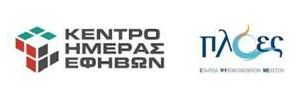

Ημερομηνία διεξαγωγής: Δευτέρα 21 Δεκεμβρίου 2020 | 18:00 - 20:30

[ΕΓΓΡΑΦΗ ΣΤΟ WEBINAR](https://forms.gle/SjMVhCJJe7gbBgcX9)

Για την συμμετοχή είναι απαραίτητη η [εγγραφή στο webinar](https://forms.gle/SjMVhCJJe7gbBgcX9). Αιτήσεις γίνονται δεκτές μέχρι και τις 20 Δεκεμβρίου 2020.

***

Τί είναι το διαδίκτυο; Ένας νέος χώρος; Μία παράλληλη πραγματικότητα; Η εφεύρεση της χιλιετίας; Το διαδίκτυο είναι κυριολεκτικά οι υπολογιστές των άλλων.

Η ανησυχία μας για την είσοδο των υπολογιστών στη ζωή μας είναι κοινή με τον προβληματισμό για κάθε τι καινούργιο. Κάθε νέα συνήθεια που διαμορφώνει το χρόνο μας διαμορφώνει και εμάς τους ίδιους.

Τα περισσότερα από αυτά που μας προτείνει δεν είναι νέα. Ούτε και οι αγωνίες που εμφανίστηκαν με την εξάπλωσή του. Ο εκφοβισμός, η ανεπιθύμητη κοινωνική επαφή και οι νέες μορφές κοινωνικών σχέσεων, ο υπερβολικός χρόνος μπροστά σε τηλεοράσεις, τα βιντεοπαιχνίδια, το ακατάλληλο ή προσβλητικό περιεχόμενο, η ασφάλεια των προσωπικών μας στοιχείων, είναι μερικά από τα θέματα που κυριαρχούν στις συζητήσεις για την εξάπλωση του διαδικτύου.

Πριν από τις απαραίτητες απαντήσεις ας θέσουμε τις κατάλληλες ερωτήσεις. Ας επιχειρήσουμε να κατανοήσουμε το διαδίκτυο, και μαζί με αυτό τους εαυτούς μας.

Το webinar είναι μέρος του έργου [Φτιάχνουμε το δικό μας ψηφιακό παιχνίδι](https://www.alphapivita.gr/projects/digital-games/) που υλοποιείται στο πλαίσιο του προγράμματος Active citizens fund, με φορέα υλοποίησης την Ανοικτή Παιδική Βιβλιοθήκη.

Εισηγητές
: Μιχάλης Παπαντωνόπουλος, Ψυχολόγος / Πολιτισμικός Ερευνητής
: Ηρακλής Παπαθεοδώρου, Digital Strategist / Αρχιτέκτονας

Φορέας υλοποίησης
: [Ανοικτή Παιδική Βιβλιοθήκη](https://www.alphapivita.gr)

Με την συνεργασία
: GameLab Panteion
: Κέντρο Ημέρας Εφήβων, Πλοές - Εταιρεία Ψυχοκοινωνικών Μελετών

&nbsp;
