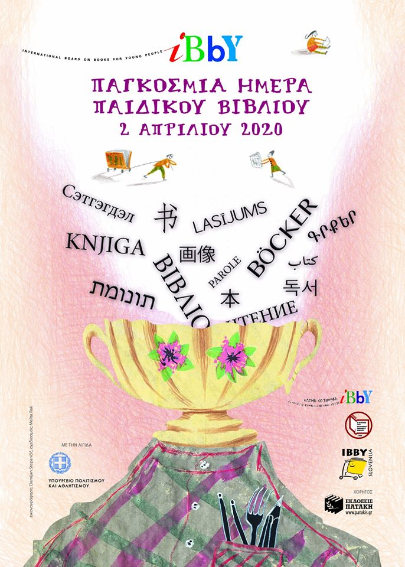

Ανεβάστε μία εικόνα σχετική με βιβλία, γράψτε μία φράση από το αγαπημένο σας παιδικό ή εφηβικό βιβλίο. Γράψτε τον τίτλο, το συγγραφέα και ταγκάρετε με #alphapivita #peinagialexeis και δύο φίλους σας να κάνουν το ίδιο από τις 2 έως 10 Απριλίου 2020.

Αυτού του είδους η πείνα χορταίνεται  με ποίηση και ιστορίες.

Οι κανόνες είναι απλοί:

1. Ανεβάστε μια εικόνα με το αγαπημένο σας παιδικό ή εφηβικό βιβλίο.
2. Στην περιγραφή της εικόνας γράψτε τον τίτλο και το όνομα του συγγραφέα μαζί με την αγαπημένη σας λέξη ή φράση από το βιβλίο.
3. Χρησιμοποιείστε τα hashtag #alphapivita #peinagialexeis #ICBD2020 #childrensbookday
4. Κάντε mention τη σελίδα της [Ανοικτής Παιδικής Βιβλιοθήκης](https://alphapivita.gr]) (@alphapivita) στο [Instagram](https://www.instagram.com/alphapivita/) ή στο [Facebook](https://www.facebook.com/alphapivita/) και τους φίλους σας για να κάνουν το ίδιο.

> Εκεί που μένω, οι θάμνοι πρασινίζουν αργά τον Απρίλη ή νωρίς τον Μάη και σύντομα γεμίζουν με κουκούλια από πεταλούδες. Αυτά τα κουκούλια μοιάζουν με μπαλίτσες από βαμβάκι ή με κουφέτα και οι νύμφες τους καταβροχθίζουν φύλλο το φύλλο μέχρι που οι θάμνοι απογυμνώνονται. Όταν όμως οι νύμφες γίνουν πεταλούδες και πετάξουν, οι θάμνοι δεν είναι κατεστραμμένοι. Καθώς πλησιάζει το καλοκαίρι, ξαναγίνονται πράσινοι πάλι και πάλι.
> 
> Έτσι μοιάζει ο συγγραφέας, έτσι μοιάζει ο ποιητής. Κατασπαράζονται, μένουν κατάστεγνοι από ιστορίες και ποιήματα, που, όταν ολοκληρωθούν, πετούν μακριά, μπαίνουν μέσα σε βιβλία και βρίσκουν τους αναγνώστες τους. Αυτό γίνεται πάλι και πάλι.
> 
> Και τι συμβαίνει μ’ εκείνα τα ποιήματα και τις ιστορίες;
> 
> Ξέρω ένα αγόρι που έπρεπε να κάνει κάποια εγχείρηση στο μάτι του. Για δύο εβδομάδες μετά την εγχείρηση, έπρεπε να ξαπλώνει μόνο από τη δεξιά πλευρά και μετά δεν έπρεπε να διαβάζει τίποτα για έναν μήνα. Όταν τελικά ξαναπήρε στα χέρια του ένα βιβλία έπειτα από ενάμιση μήνα, ένιωσε σαν να κατάπινε λέξεις μ’ ένα κουτάλι από μια γαβάθα. Σαν να τις έτρωγε. Πραγματικά τις έτρωγε.
> 
> Ξέρω κι ένα κορίτσι που, όταν μεγάλωσε, έγινε δασκάλα. Μου είπε: “Τα παιδιά που οι γονείς τους δεν τους διάβασαν παραμύθια έχουν στερηθεί κάτι σημαντικό”.
> Οι λέξεις στα ποιήματα και στις ιστορίες είναι τροφή. Όχι τροφή για το σώμα, όχι τροφή που μπορεί να γεμίσει το στομάχι σου. Τροφή όμως για το πνεύμα και τροφή για την ψυχή.
> 
> Όταν πεινάει κάποιος ή διψάει, το στομάχι του γουργουρίζει και το στόμα του στεγνώνει. Οι πεινασμένοι γυρεύουν να φάνε κάτι, ένα κομμάτι ψωμί, ένα πιάτο ρύζι ή δημητριακά, λίγο ψάρι ή μια μπανάνα. Όσο περισσότερο πεινούν, τόσο στενεύει ο οπτικός τους ορίζοντας, ώσπου παύουν να βλέπουν ό,τι δεν είναι τροφή για να τους χορτάσει.
> 
> Η πείνα για λέξεις εκδηλώνεται διαφορετικά. Μοιάζει με θλίψη, με λήθη, με αυθάδεια. Οι άνθρωποι που υποφέρουν από τέτοιου είδους πείνα δε νιώθουν πως η ψυχή τους τρέμει από το κρύο κι ότι προσπερνούν τους εαυτούς τους χωρίς να το προσέχουν. Ένα μέρος του κόσμου τους εξαφανίζεται χωρίς να το γνωρίζουν.
> Αυτού του είδους η πείνα χορταίνεται με ποίηση και ιστορίες.
> 
> Υπάρχει όμως ελπίδα για όσους δεν έχουν ποτέ αφεθεί ν’ απολαύσουν τις λέξεις, για να χορτάσουν αυτή την πείνα;
> 
> Υπάρχει! Το αγόρι που είπαμε διαβάζει κάθε μέρα. Το κορίτσι έγινε δασκάλα και διαβάζει στους μαθητές της. Κάθε Παρασκευή. Κάθε βδομάδα. Αν κάποια φορά το ξεχάσει, της το θυμίζουν τα παιδιά.
> 
> Και τι γίνεται με τον συγγραφέα και τον ποιητή; Καθώς έρχεται το καλοκαίρι, θα πρασινίσουν πάλι. Και πάλι θα στεγνώσουν από ιστορίες και ποιήματα, που θα πετάξουν μακριά προς κάθε κατεύθυνση. Πάλι και πάλι.
> 
> — «Πείνα για λέξεις», Peter Svetina  
> (Μετάφραση: Λότη Πέτροβιτς-Ανδρουτσοπούλου)

