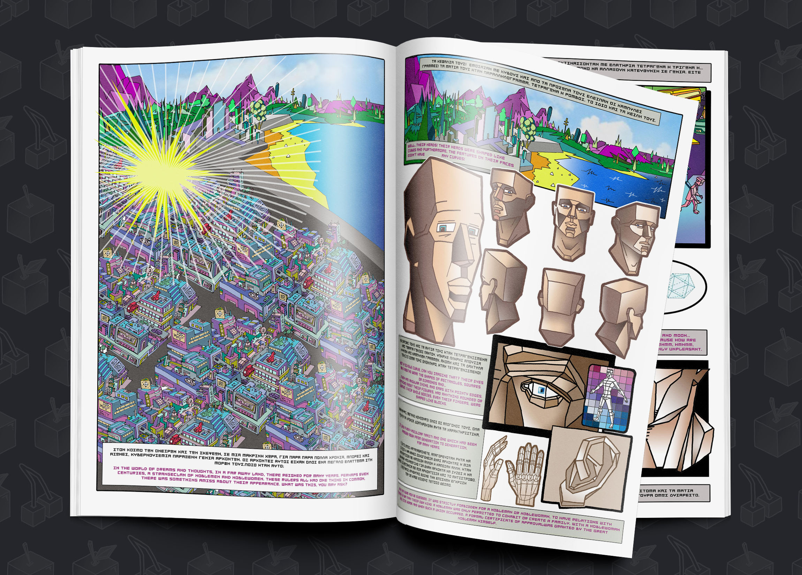

Το κόμικ «Στη χώρα που δεν είχε κύκλους» είναι μια τετράγλωσση (Ελληνικά - Αγγλικά - Φαρσί - Αραβικά) έντυπη, ακουστική, και  ψηφιακή έκδοση που προσφέρει τη δυνατότητα σε παιδιά με διαφορετικό γλωσσικό υπόβαθρο, αλλά και αναπηρίες να μοιραστούν μία κοινή ιστορία.

<a href="http://nocircles.alphapivita.gr/" target="_blank">Ξεφύλλισε το δωρεάν ψηφιακό βιβλίο</a>

Έχει σχεδιαστεί σαν μία συνολική καλλιτεχνική εμπειρία: εκτός από την πλούσια εικονογράφηση, η αναγνώστρια μπορεί να συνδεθεί με το μουσικό σύμπαν της έκδοσης. Η πρωτότυπη μουσική που έχει γραφτεί και ενορχηστρωθεί για την έκδοση, καθώς και ηχητικά εφέ που ντύνουν την αφήγηση αποτελούν τη ψηφιακή εκδοχή του κόμικ που είναι διαθέσιμη μόνο στη σελίδα της *Ανοικτής Παιδικής Βιβλιοθήκης*.

Θα το βρείτε διαθέσιμο στα ενημερωμένα βιβλιοπωλεία, και δωρεάν σαν ψηφιακό βιβλίο στο www.alphapivita.gr, σε έκδοση της Ανοικτής Παιδικής Βιβλιοθήκης σε συνεργασία με τις *Εκδόσεις Levantes*.

Το κόμικ είναι μέρος της δράσης «Στη χώρα που δεν είχε κύκλους – ένα βιβλίο προσβάσιμο σε όλα τα παιδιά», η οποία υλοποιήθηκε με επιχορήγηση του Υπουργείου Πολιτισμού και Αθλητισμού, για την ενίσχυση των γραμμάτων και του βιβλίου.

***

Πρωτότυπη ιδέα - Σενάριο
: Σταύρος Αθανασιάδης

Εικονογράφηση
: The Krah

Διεύθυνση παραγωγής και έκδοσης
: Σταύρος Αθανασιάδης

Μουσική, ηχητικός σχεδιασμός, παραγωγή, μίξη
: Ιάσων Αθανασιάδης

Ψηφιακή επεξεργασία, δημιουργία ιστοσελίδας
: Φίλιππος Φωτόπουλος

Γραφιστική επιμέλεια
: Δημήτρης Γαζής

Αφήγηση στα Ελληνικά
: Ναταλία Κάντζια

Μετάφραση & αφήγηση στα Αγγλικά
: Άντζελα Ελ-Ζειντ

Μετάφραση & αφήγηση στα Αραβικά
: Χισάμ Ομάρ Μπαχλούλ

Μετάφραση & αφήγηση στα Φαρσί
: Ρ

Επιμέλεια στα Ελληνικά
: Ελένη Κοπανάκη

Βιολί & αυτοσχεδιασμός
: Διονύσης Βερβιτσιώτης

Κιθάρα, ηλ. κιθάρα, κοντραμπάσο κ.α.
: Ιάσων Αθανασιάδης